

<!-- ================================================================ -->
<!-- 1. BOOT / HERO                                                   -->
<!-- ================================================================ -->

  

<!-- ================================================================ -->
<!-- 2. WHOAMI / IDENTITY                                             -->
<!-- ================================================================ -->

  

<!-- ================================================================ -->
<!-- 3. SYSTEM STATUS / GITHUB STATS                                  -->
<!-- ================================================================ -->

  

<!-- ================================================================ -->
<!-- 4. TECH STACK                                                    -->
<!-- ================================================================ -->

  

<!-- ================================================================ -->
<!-- 5. CYBERPUNK CONTRIBUTION CITY (VISUAL CENTERPIECE)              -->
<!-- ================================================================ -->

  

<!-- ================================================================ -->
<!-- 6. CURRENT MISSION / ACTIVITY                                    -->
<!-- ================================================================ -->

  

<!-- ================================================================ -->
<!-- 7. LINKS / TERMINAL CHANNELS (INDIVIDUALLY CLICKABLE)            -->
<!-- ================================================================ -->
 
<table border="0" cellpadding="0" cellspacing="6" align="center" style="border: none; background: transparent; width: 100%; max-width: 900px; margin: 4px 0;">
  <tr>
    <td width="33.33%" align="center" style="border: none; padding: 0;">
      <a href="https://www.facebook.com/teaman.2606" target="_blank" rel="noopener noreferrer">
        
      </a>
    </td>
    <td width="33.33%" align="center" style="border: none; padding: 0;">
      <a href="https://www.linkedin.com/in/temazzdev" target="_blank" rel="noopener noreferrer">
        
      </a>
    </td>
    <td width="33.33%" align="center" style="border: none; padding: 0;">
      <a href="https://dev.to/temaz_2606" target="_blank" rel="noopener noreferrer">
        
      </a>
    </td>
  </tr>
</table>

  

<!-- ================================================================ -->
<!-- 8. FOOTER / EOF                                                  -->
<!-- ================================================================ -->

